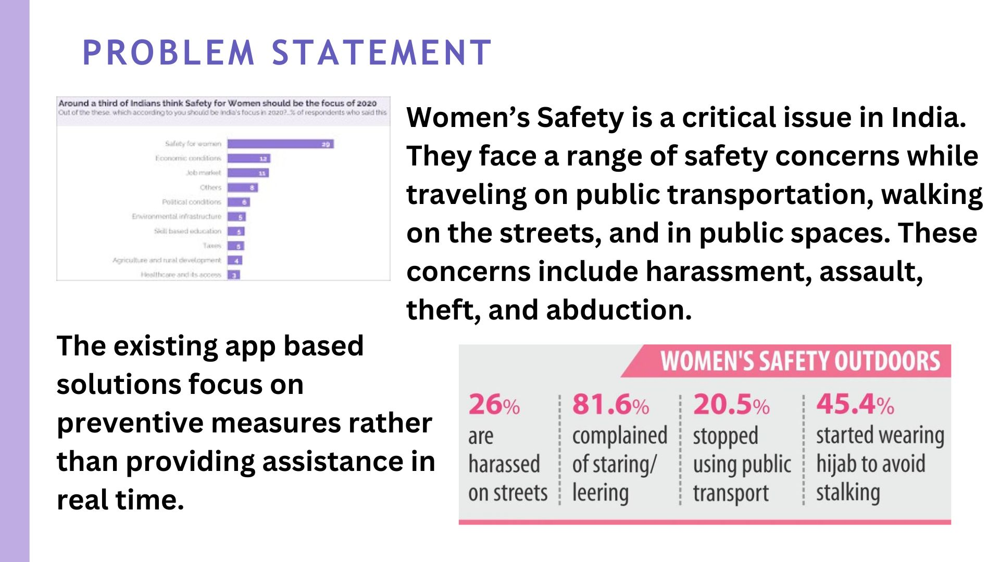
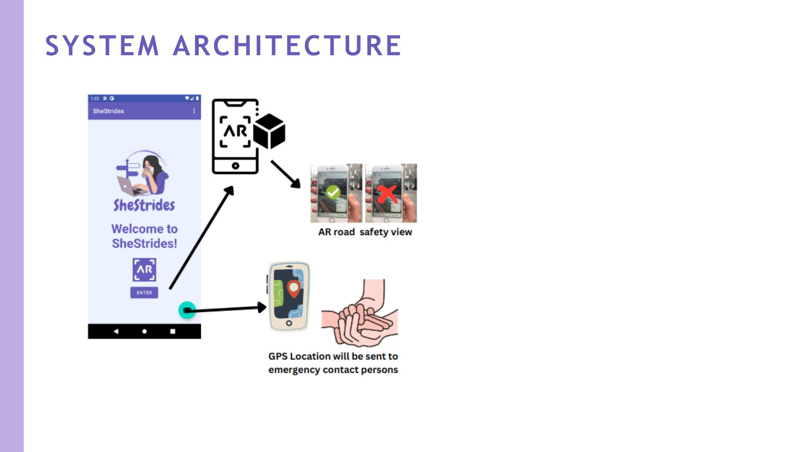
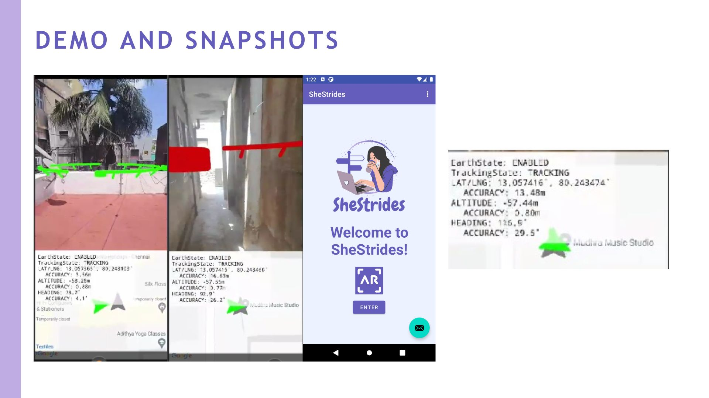

# SheStrides: Augmented Reality Guide for Safer Roads

## Overview
**SheStrides** is an innovative mobile application designed to empower women by providing real-time navigation and safety insights through augmented reality. Utilizing **Google ARCore** and **Google Geospatial API**, the app offers a personalized and accessible guide to safer routes.


---

## Problem Statement
Women in India face various safety challenges while traveling in public spaces. Existing app-based solutions focus on preventive measures but lack real-time assistance. **SheStrides** bridges this gap by leveraging AR for immediate and reliable guidance.



---

## Features
- **Real-Time Assistance**: Provides immediate safety insights for routes.
- **Crowdsourced Data**: Collects safety ratings from authenticated users.
- **Personalized Navigation**: Adapts based on user preferences and previous routes.
- **Augmented Reality Views**: Displays safe and unsafe zones visually in AR.
- **Emergency Support**: Shares live location with emergency contacts during panic situations.

---

## System Architecture


1. **AR Road Safety View**: Highlights safe and unsafe zones visually.
2. **Geospatial Navigation**: Tracks user location with high accuracy.
3. **Emergency Alerts**: Sends GPS coordinates to emergency contacts.

---

## Tech Stack
- **Kotlin**: Primary language for Android development.
- **Google ARCore API**: For building AR features.
- **Google Geospatial API**: For precise location tracking.
- **AI Personalization**: Adapts suggestions based on user preferences.
- **Crowdsourced Database**: Aggregates safety insights.

---

## Demo and Snapshots


---

## Installation
1. Clone the repository:
   ```bash
   git clone https://github.com/SheStrides/AR-Safety-Guide.git
   ```
2. Open the project in **Android Studio**.
3. Configure the **Google Developer API** keys:
   - **ARCore API**.
   - **Geospatial API**.
4. Build and run the app on a compatible Android device.
